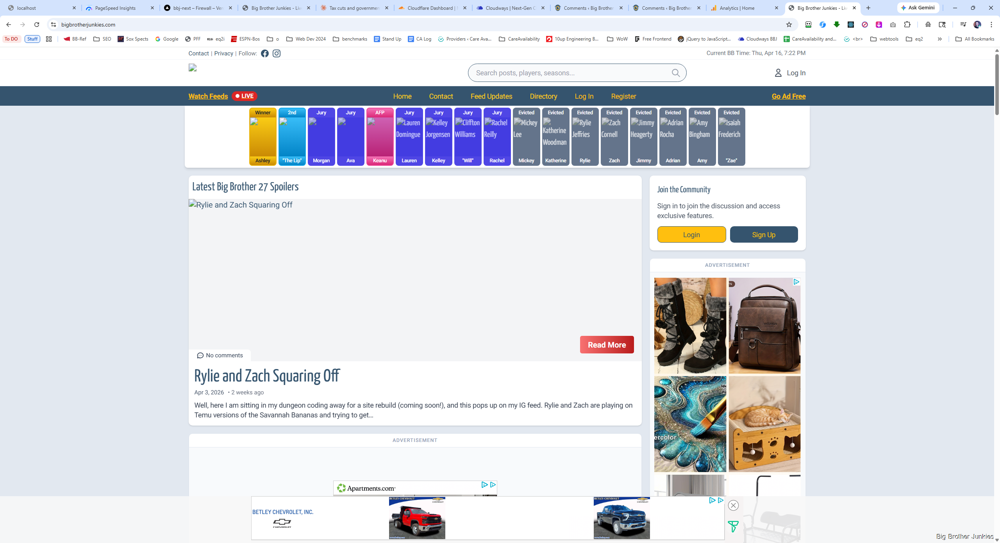
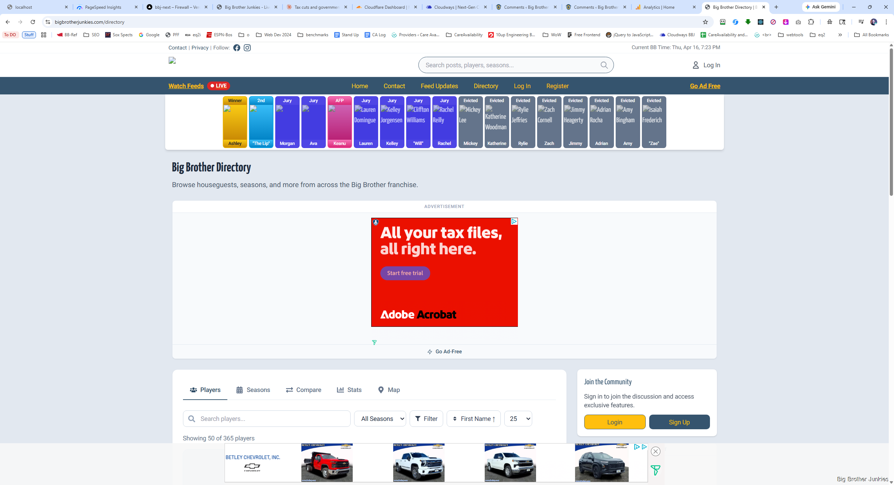
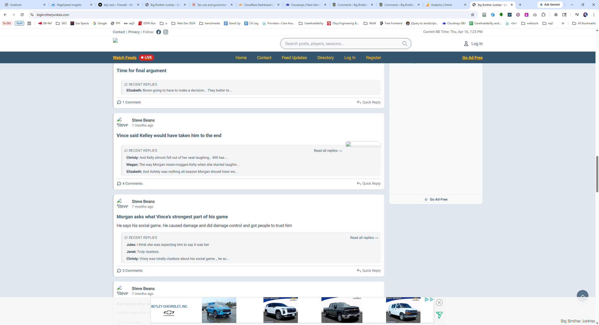

Here are some things I"m noticing on live

- There is no ad in header area 
- There IS one on directory, this would be a fine one to use for all the pages really I think 
- Second sidebar ad isn't sticking like I thought it was 
